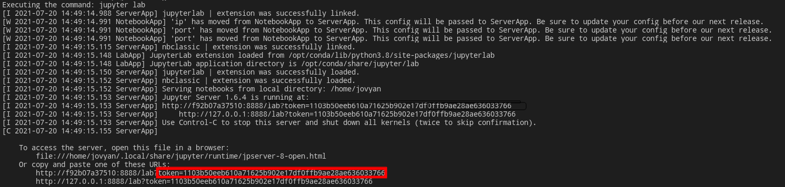
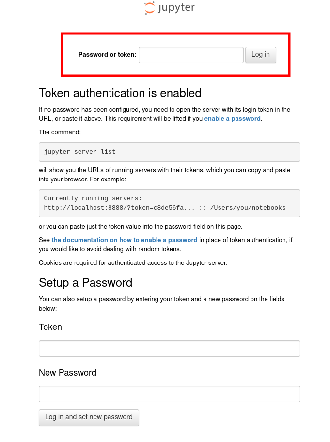

Docker file for the analysis of Pijuan and Sala.

**Warning**: The analysis has not been completed yet. Some parts of the code ar nonsense so be careful to run it for now.

**Warning**: The bash files are have been writen for Linux. Maybe in Mac or PC, the lines are different. The scripts are pretty simple so they should be straighforward to adapt.

# Use without docker

In the file `requirements.txt` there is the defined basic packages used and its versions for the analysis. The analsys is performed using Python3.8.8.

Inside home, you will find all the analysis scripts.

The necessary data for the analysis can be obtained running

```
./download_data
```

# Use with Docker

## 1. Building the docker
A docker image with the required python version and packages can be created running

```
./build_git
```

## 2. Getting the data
The necessary data for the analysis can be obtained running

```
./download_data
```

## 3. Running the docker
For running the docker and go over the analysis steps in a jupyter lab session, just run,

```
./run
```

Once run, the docker will be working and executing in the channel 10000. Change the channel in the `run` script if you want to run it in some other channel.. In the terminal you will find a token code that is generated for security reasons:



Copy that number. For accessing the session, open your favorite folder brwoser and search `localhost:10000`. Directly from the terminal it will be something like,

```
firefox localhost::10000
```

it will open a jupyterlab session that will ask for a password or token.  



Copy the token you obtained before and you will be set up! 

Anything in the `home` folder can be seen by the docker and you and will be saved after the docker is finished.


